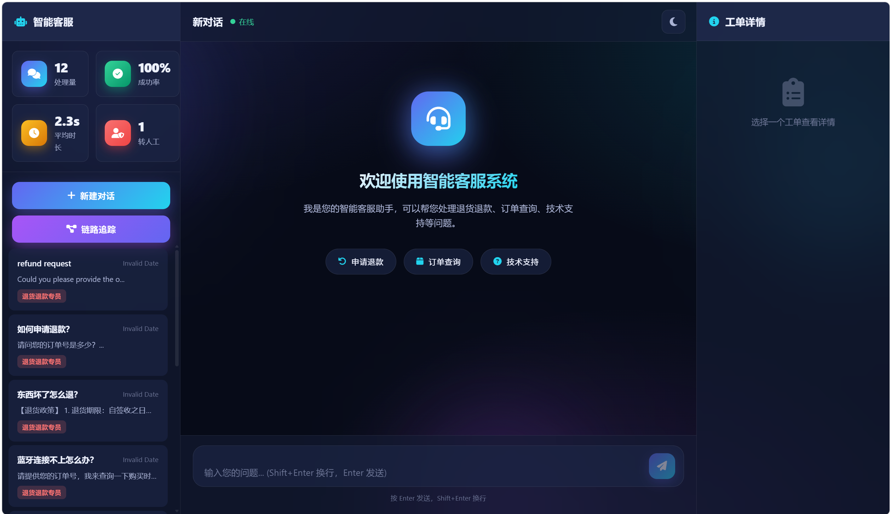

# 智能客服多 Agent 系统（smart_cs）

基于 **FastAPI + 通义千问 qwen-max** 的多 Agent 智能客服系统：RouterAgent 意图路由调度 4 个专业 Agent（退款 / 技术 / 订单 / 通用），融合 **混合检索 RAG（FAISS 向量 + BM25 + RRF 融合）**、**SQLite 持久化数据层**、**全链路异步 + 真·流式（SSE）**，并具备 **低置信自动转人工闭环** 与 **请求级链路追踪可观测**。

技术栈：Python · FastAPI · asyncio · LangChain · 通义千问(qwen-max) · FAISS · BM25/RRF · SQLite · Redis · SSE 流式 · 多 Agent 编排

---

## ✨ 核心特性

| 能力 | 说明 |
|---|---|
| **多 Agent 编排** | RouterAgent 意图识别 → RefundAgent / TechAgent / OrderAgent / GeneralAgent，职责隔离、工具权限隔离 |
| **双引擎路由** | 关键词快路径（省 LLM 调用、低延迟）+ LLM 语义分类 + 多轮上下文感知；自建 108 条评测集，准确率 **100%** |
| **混合检索 RAG** | `HybridFAQRetriever`：FAISS 向量召回 + BM25 关键词召回 → RRF 融合重排 → 返回置信度与引用出处 |
| **置信度门控抗幻觉** | 检索置信度 ≥0.60 直接命中 FAQ；<0.35 标记低置信并触发转人工 |
| **全链路异步 + 真流式** | 基于 LangChain Runnable 的 `QwenLLM.astream`（线程+Queue 桥接 DashScope 同步流）；`BaseAgent.astream` 逐 token 真流式，不阻塞事件循环 |
| **SQLite 持久化** | Repository 模式（订单 / 工单 / 每日指标三表）+ 800 条合成订单 seed，服务重启零丢失 |
| **转人工闭环** | 低置信 / 兜底话术自动转人工：SSE `escalation` 事件 + 工单 `escalated=1` 落库 + 统计累计 |
| **可观测** | `RequestTrace / TraceSpan / TraceStore` 环形缓冲 + `/api/traces` 接口 + 前端链路追踪面板 |
| **现代前端** | 原生 JS SPA，极光玻璃拟态 UI，深/浅色主题切换，助手头像按 Agent 着色 |

---

## 🖼️ 界面预览



极光玻璃拟态 UI，支持深/浅色主题切换、按 Agent 着色的头像、实时链路追踪与工单详情面板。

---

## 🏗️ 系统架构

```
用户请求
   ↓
RouterAgent（关键词快路径 + LLM 语义分类 + 上下文感知）
   ↓
┌──────────────┬──────────────┬──────────────┬──────────────┐
RefundAgent    TechAgent      OrderAgent     GeneralAgent
(退货退款)     (技术支持)     (订单查询)     (通用咨询)
   │              │              │              │
规则优先        混合检索RAG     SQLite查询      LLM+工具
approve_refund  置信度门控      query_order    search_faq
   │              │(低置信→转人工) │              │
   └──────────────┴──────────────┴──────────────┘
                  ↓
        真·流式输出（SSE: routing / token / escalation / done）
                  ↓
        持久化落库（SQLite: tickets / daily_metrics）+ 链路追踪
```

---

## 🔗 LangChain 工程实践（简历 / 面试重点）

本项目**确实落地了 LangChain**，而非仅用 `@tool` 装饰器：核心 LLM 与 Embedding 均继承自 LangChain 标准基类，工具调度使用**原生 function calling**，全链路走 LCEL Runnable 协议。

| 实践点 | 说明 |
|---|---|
| **自定义 ChatModel** | `QwenLLM(BaseChatModel)`：把阿里云百炼（DashScope）通义千问封装为标准 LangChain `Runnable`，实现 `_generate / _agenerate / _stream / _astream`，对外暴露统一的 `invoke / ainvoke / stream / astream`。 |
| **自定义 Embeddings** | `QwenEmbeddings(Embeddings)`：把通义千问向量模型封装为 LangChain `Embeddings`，直接喂给 `FAISS` 向量检索与 `EnsembleRetriever`，是混合检索 RAG 的向量通道。 |
| **原生 function calling（非手写正则）** | Agent 工具调度基于 `llm.bind_tools(tools)`：模型返回结构化的 `AIMessage.tool_calls`，ReAct 循环**直接读取结构化 `tool_calls`** 执行工具并回填 `ToolMessage`，彻底替代早期手写的 `[TOOL_CALL]...[/TOOL_CALL]` 正则解析（更稳、可扩展、贴合官方范式）。 |
| **全链路 LCEL + 异步真流式** | 异步入口走 `ainvoke / astream`；`astream` 通过线程 + `asyncio.Queue` 桥接 DashScope 同步流，在 FastAPI 事件循环内逐 token 输出，不阻塞。 |
| **消息协议对齐** | 所有 LLM 交互统一使用 `HumanMessage / AIMessage / SystemMessage / ToolMessage`，与 LangChain 回调、tracing、`RunnableBinding` 天然兼容。 |

> 注：本仓库使用的是 **LangChain 1.x（`langchain-core` + `langchain`）**。其官方已废弃 `langchain.agents.AgentExecutor` 等旧版 Agent 编排，转向 **LangGraph**；因此本项目保留「LLM 原生 function calling + 自写 ReAct 循环」的轻量方案，既贴合 1.x 范式，又避免引入额外编排框架，便于讲清工具调用全流程。

---

## 📦 项目结构

```
smart_cs/
├── backend/
│   ├── main.py            # FastAPI 入口 + lifespan 初始化（注入默认混合检索器、初始化 DB）
│   ├── api.py             # 路由层：/api/chat(SSE)、tickets、stats、traces、health、upload-faq
│   ├── config.py          # 配置 + 阈值常量（RAG_CONF_HIGH/LOW、ESCALATION_CONFIDENCE、TRACE_BUFFER_SIZE）
│   ├── llm.py             # ★ QwenLLM(BaseChatModel) / QwenEmbeddings(Embeddings)：LangChain 标准封装 + 原生 bind_tools 函数调用
│   ├── rag.py             # FAQProcessor：FAISS 向量支路（作为混合检索的向量通道）
│   ├── rag_retriever.py   # ★ HybridFAQRetriever：向量 + BM25 + RRF 融合 + 置信度 + 引用溯源
│   ├── tracing.py         # ★ RequestTrace / TraceSpan / TraceStore（可观测）
│   ├── models.py          # Pydantic 数据模型
│   ├── memory.py          # ConversationMemory：Redis + 内存降级
│   ├── faq_data.py        # 预设 FAQ 知识库 + 政策库
│   ├── static_server.py   # 前端静态文件 + SPA 路由
│   ├── db/                # ★ 数据层
│   │   ├── repository.py  #   Database + OrderRepository / TicketRepository / StatsRepository（含迁移）
│   │   ├── schema.sql     #   orders / tickets / daily_metrics 表结构
│   │   └── seed.py        #   合成订单 seed
│   ├── agents/            # base / router / refund / tech / order / general
│   └── tools/             # order_tools / knowledge_tools / system_tools
├── frontend/              # index.html / app.js / style.css（玻璃拟态 SPA + 主题切换）
├── assets/                # README 截图等静态资源
│   └── preview.png
├── tests/                # ★ 测试套件（见下）
│   ├── test_hybrid_retriever.py   # 混合检索冒烟
│   ├── test_async_stream.py       # 异步 + 真流式
│   ├── test_db_layer.py           # 数据层
│   ├── test_escalation_tracing.py # 转人工 + 可观测
│   ├── eval_router.py             # 路由意图评测（108 样本）
│   └── data/router_eval.jsonl     # 标注评测集
├── scripts/seed_data.py  # 独立 seed 脚本（--force 重建）
├── data/                 # faq_index.*（FAISS 索引）+ smart_cs.db（SQLite，运行时生成，已 gitignore）
├── requirements.txt / pyproject.toml / uv.lock
├── Dockerfile           # 生产镜像（python:3.13-slim，单 worker）
├── docker-compose.yml   # 编排：app + redis + nginx（反代）
├── .dockerignore
├── nginx.conf           # 反向代理（SSE 长连接友好 + HTTPS 参考）
├── DEPLOY.md            # 阿里云 ECS 部署指南
└── .env.example
```

> ★ 标记为相对原始版本新增/重写的关键模块。

---

## 🚀 快速开始

### 1. 安装依赖

```bash
# 使用 uv（推荐，项目已配置 uv 环境）
uv pip install -r requirements.txt
# 或
pip install -r requirements.txt
```

### 2. 配置环境变量

```bash
cp .env.example .env      # 填入 DASHSCOPE_API_KEY
```

```env
DASHSCOPE_API_KEY=your_actual_api_key_here
LLM_MODEL=qwen-max
```

> Redis 为**可选**：未启动时自动降级到内存字典，不影响运行。

### 3.（可选）初始化订单数据

```bash
python scripts/seed_data.py            # 首次生成 800 条合成订单
python scripts/seed_data.py --force    # 强制重建
```

### 4. 启动服务

```bash
python -m backend.main
# 或
uvicorn backend.main:app --host 0.0.0.0 --port 8000 --reload
```

- 前端 SPA：http://localhost:8000
- API 文档：http://localhost:8000/docs

---

## 🐳 容器化部署（Docker）

已内置 `Dockerfile` + `docker-compose.yml`（app + redis + nginx 反代），可一键部署到阿里云等云服务器。详见 **[DEPLOY.md](./DEPLOY.md)**。

```bash
cp .env.example .env          # 填入 DASHSCOPE_API_KEY
docker compose up -d --build  # 构建并后台启动
# 浏览器访问 http://<服务器IP>（nginx 在 80 端口反代）
```

要点：
- 数据持久化：`app-data` 卷保存 SQLite + FAISS 索引，`redis-data` 保存会话，重启不丢。
- 单 worker 运行（规避 SQLite 多进程写锁）；需要更高并发请切换 PostgreSQL 后增加 worker。
- `nginx.conf` 已关闭代理缓冲并放大超时，原生支持 SSE 长连接；内含 HTTPS 参考配置。

---

## 🧪 测试

测试为**独立脚本**（自带 `__main__`，无需 pytest），除路由评测外均离线可跑（FakeLLM / Fake 检索器，免网络、免真实索引）：

```bash
python tests/test_hybrid_retriever.py     # 混合检索：BM25 / RRF / 置信度 / 增量重建
python tests/test_async_stream.py         # 异步 ReAct + astream 真流式 + aroute
python tests/test_db_layer.py             # 建表 / seed 幂等 / 查询 / 工单落库 / 统计聚合
python tests/test_escalation_tracing.py   # 转人工工具 / TraceStore / 迁移 / SSE 端到端
python tests/eval_router.py               # 路由评测（离线 FakeLLM，输出准确率/混淆矩阵）
```

路由评测支持三种模式：

```bash
python tests/eval_router.py            # 离线 FakeLLM（默认）
python tests/eval_router.py --async    # 走 aroute 异步路径
python tests/eval_router.py --real     # 真实 QwenLLM（需 DASHSCOPE_API_KEY）
```

当前评测结果：**准确率 100%（108/108）**，宏平均 P/R/F1 = 1.0，快路径占比 ~58%。

---

## 📡 API 接口

| 方法 | 路径 | 说明 |
|---|---|---|
| POST | `/api/chat` | 聊天（SSE 流式：`routing` / `token` / `escalation` / `done`） |
| GET | `/api/tickets` | 工单历史（支持 `limit/offset/agent_type/user_id` 过滤） |
| GET | `/api/stats` | 运行统计（含成功率、各 Agent 计数、转人工次数） |
| GET | `/api/traces` | 请求链路追踪（支持 `escalated_only` 过滤） |
| GET | `/api/health` | 健康检查 |
| POST | `/api/upload-faq` | 上传 FAQ（JSON / TXT） |

**聊天请求：**

```http
POST /api/chat
Content-Type: application/json

{ "user_message": "蓝牙连接不上怎么办？", "session_id": "s1", "user_id": "u1" }
```

**SSE 响应：**

```
data: {"type": "routing", "agent": "tech_support", "confidence": 0.95}
data: {"type": "token", "token": "蓝牙"}
data: {"type": "escalation", "reason": "检索置信度过低", "priority": "high"}   ← 低置信时出现
data: {"type": "done", "done": true, "ticket_id": "xxx", "escalated": false}
```

---

## 🛠️ Agent 与工具

| Agent | 职责 | 关键设计 |
|---|---|---|
| RouterAgent | 意图识别与路由 | 关键词预检 + LLM 分类 + 上下文感知 |
| RefundAgent | 退货退款 | 规则优先（正则/预设逻辑），减少 LLM 调用与幻觉 |
| TechAgent | 技术支持 | 混合检索 RAG + 置信度门控（低置信转人工） |
| OrderAgent | 订单查询 | SQLite 真实订单查询 |
| GeneralAgent | 通用咨询 | LLM + 工具循环兜底 |

**工具集**：`query_order_status` / `approve_refund` / `get_order_detail`（订单）· `search_faq` / `search_policy`（知识库）· `get_current_time` / `escalate_to_human` / `validate_user_input`（系统）

> 工具调度统一基于 LangChain **`bind_tools` 原生 function calling**：`BaseAgent.__init__` 把工具绑定到 `QwenLLM`（`llm.bind_tools(tools)`），模型返回结构化 `AIMessage.tool_calls`，ReAct 循环直接读取并执行、回填 `ToolMessage`，**不再使用手写正则解析 `[TOOL_CALL]`**。

---

## 🔧 关键阈值配置（`backend/config.py`）

| 常量 | 默认 | 作用 |
|---|---|---|
| `RAG_CONF_HIGH` | 0.60 | 高于此值直接命中 FAQ，不再调 LLM |
| `RAG_CONF_LOW` | 0.35 | 低于此值标记低置信 |
| `ESCALATION_CONFIDENCE` | 0.35 | 转人工触发阈值 |
| `TRACE_BUFFER_SIZE` | 200 | 链路追踪环形缓冲容量 |

---

## 📝 生产化建议（后续可演进）

- ✅ 部署：已提供 Dockerfile + docker-compose + nginx 反代 + 阿里云部署指南（DEPLOY.md）。
- 鉴权：接入 API Key / JWT，CORS 经 `ALLOWED_ORIGINS` 收口到前端域名。
- 数据库：SQLite → aiosqlite / PostgreSQL（异步驱动）以支持多 worker 水平扩展。
- 可观测：进程内 TraceStore → OpenTelemetry / Langfuse（仅替换 push/log 实现）。

## 📄 许可证

MIT License

## 🤝 贡献

欢迎提交Issue和Pull Request！

## 📧 联系方式

如有问题，请联系：l2172433823@163.com
